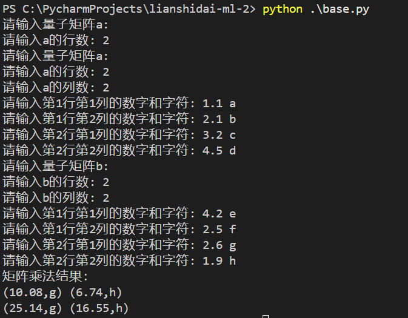

<font color="#87CEEB" size="5">🌈 做题笔记</font>

### 写在前面

<details>
<summary><strong>🌟 写在前面</strong></summary>

---

本项目已经开源在github仓库：  
```bash
https://github.com/wwwwwwwq/lianshidai-ml-2.git
```

---

各个.py文件介绍：
```bash
base.py：主运行程序，运行之后就会让输入矩阵a和矩阵b并进行运算
test.py: 测试文件程序，主要是用来测试两个给定的量子矩阵相乘的。
```
</details>

### 题目理解

<details>
<summary><strong>💡 题目理解</strong></summary>

---

那么题目已经讲得很清晰了，就是要利用python的OOP，然后来实现
QuantumMatrix类的multiply(other: "QuantumMatrix") -> "QuantumMatrix"方法，然后定义了量子矩阵相乘的规则：
```bash
✅ 矩阵乘法计算（数字计算方式与普通矩阵乘法一致）
✅ 字母 取两者中 ASCII 码较大的字符
✅ 时空撕裂异常（如果矩阵维度不匹配，则抛出 QuantumDimensionError）
```
所以我们只需要模拟这个规则来编写multiply就可以了  
</details>

### 解决题目

<details>
<summary><strong>🔧 面向对象编程</strong></summary>

---
  
那么要解决这个题目，我们就需要了解**面向对象编程**的“类”以及“实例”，“魔术方法”等概念。  
  
- ### 类  
    所谓**类**，其实就是**抽象**的模板，它用来描述**一些具有相同行为或者对象**的模板。比如这题当中的**QuantumMatrix类**，它就是用来描述**量子矩阵**这个对象的一些相同行为，比如量子矩阵乘法，量子矩阵的属性等。
    **类**还具有封装，继承，多态等内容，这题我们涉及到的有**封装**：**QuantumMatrix类**类封装了**mutiply**,**__init__**等方法，**data**等变量；**继承**：**QuantumMatrixError类**继承了**错误异常类Exception**。
- ### 实例  
    **实例**就是**根据类创建出的一个个具体的对象**。比如此题的量子矩阵a和量子矩阵b等就是由量子矩阵类**实例化**出来的对象
- ### 魔术方法
    **魔术方法**是指python中的**特殊方法**，它可以让类自定义一些特殊的行为，比如初始化，输出字符串等。在此题中就可以用__init__来初始化实例，用__str__来输出字符串
</details>

<details>
<summary><strong>💻 量子矩阵类</strong></summary>

---

在**量子矩阵类QuantumMatrix**中，我们要定义一些关于量子矩阵的行为，这里主要涉及到的是：**初始化**，**量子矩阵乘法**。  
  
- **初始化**
    量子矩阵应该是个**二维列表**，里面存储的是每一行（用列表表示）的矩阵，而每一行的元素用tuple表示，大概类似于[[(2.5,'α'), (-1.8, 'β')],[(0.9, 'γ'), (4.2, 'δ')]]。所以我们初始化先获取**行数**和**列数**：
    ```python
    #定义__init__魔法方法，用于初始化量子矩阵
        def __init__(self, data):
            """
            初始化量子矩阵
            """
            """
            data为二维列表，每个元素为tuple，形式是（数字，字符）
            例如QuantumMatrix([
            [(2.5, 'α'), (-1.8, 'β')],
            [(0.9, 'γ'), (4.2, 'δ')]
            ])
            则表示量子矩阵为
            （2.5，α） （-1.8，β）
            （0.9 ，γ） （4.2，δ）
            （注意量子矩阵和普通矩阵不同，量子矩阵的每个区域是有一个数字和一个字符的）
            所以行数为data的长度，列数为data中每个元素的长度
            """
            self.data = data
            self.rows = len(data)
            self.cols = len(data[0]) if self.rows > 0 else 0#判断是否非零
    ```
- **量子矩阵乘法**
接下来我们就按照题目意思完成量子矩阵乘法的构造就可以了。那么该怎么进行量子矩阵乘法呢？我们通过下面这个例子理解一下：  
比如这两个量子矩阵相乘：    
$$  
\begin{pmatrix}
1,a & 2,b & 3,c\\
4,d & 5,e & 6,f\\
\end{pmatrix}
\times
\begin{pmatrix}
1,a & 2,b\\
3,c & 4,d\\
5,e & 6,f\\
\end{pmatrix}
$$  
那么我们根据线性代数的知识，知道**矩阵相乘**应该先**确定第一个矩阵的行，然后确定第二个矩阵的列，然后再用第一个矩阵的第一行第一列元素乘第二个矩阵的第一行第一列的元素，加上第一个矩阵的第一行第二列的元素乘第二个矩阵的第二行第二列的元素**。那么由于数字运算是单独的，所以下面就不考虑字符。所以上面两个矩阵相乘的数字部分最终答案的运算类似于下面这样：  
$$
\begin{pmatrix}
1\times1+2\times3+3\times5 & 1\times2+2\times4+3\times6 \\
4\times1+5\times3+6\times5 & 4\times2+5\times4+6\times6 \\
\end{pmatrix}
=
\begin{pmatrix}
22 & 28 \\
49 & 64 \\
\end{pmatrix}
$$
而字符运算的话只需要在每次遍历行和列的时候取**ascii码最大**的即可。比如当取第一个矩阵的第一行（记作x行），第二个矩阵的第二列（记作y列）时，我们只需比较$a,b,c,a,c,e$中的ascii码最大的字符，也就是e。以此类推，我们可以得到上面给出的两个量子矩阵相乘的最终答案是：  
$$
\begin{pmatrix}
22,e & 28,f \\
49,f & 64,f \\
\end{pmatrix}
$$
那么我们只需用程序模拟一下即可：  
    ```python
    #self是类的实例本身，other是传入的参数，other: 'QuantumMatrix'表示other的类型是QuantumMatrix，-> 'QuantumMatrix'表示返回值的类型是QuantumMatrix
        #这里的self就是量子矩阵a本身，而other其实就传入另外一个要相乘的量子矩阵b
        def multiply(self, other: 'QuantumMatrix') -> 'QuantumMatrix':
            """
            矩阵乘法
            """
            #判断矩阵是否可以相乘，也就是检查维度是否匹配
            #如果a的列数≠b的行数，则抛出时空撕裂异常
            if self.cols != other.rows:
                raise QuantumDimensionError("时空撕裂异常 QuantumDimensionError ⚠️")
            
            """
            这里简述一下量子矩阵乘法的运算过程。举一个例子：
            矩阵a：
            （2.5，α） （-1.8，β）
            （0.9 ，γ） （4.2，δ）
            矩阵b：
            （1.1，ε） （2.3，ζ）
            （-0.5，η） （3.4，θ）
            
            a的第一行，b的第一列（i=0,j=0）：
            结果矩阵的(1,1)=a的第一行，b的第一列
            数字运算：(2.5×1.1)+(-1.8×-0.5)=2.75+0.9=3.65
            字符运算：从 α, β, ε, η 中选择ASCII码最大的，记作max_char1

            a的第一行，b的第二列（i=0,j=1）：
            结果矩阵的(1,2)=a的第一行，b的第二列
            数字运算：(2.5×2.3)+(-1.8×3.4)=5.75-6.12=-0.37
            字符运算：从 α, β, ε, ζ 中选择ASCII码最大的，记作max_char2

            a的第二行，b的第一列（i=1,j=0）：
            结果矩阵的(2,1)=a的第二行，b的第一列
            数字运算：(0.9×1.1)+(4.2×-0.5)=0.99-2.1=-1.11
            字符运算：从 γ, δ, ε, η 中选择ASCII码最大的，记作max_char3

            a的第二行，b的第二列（i=1,j=1）：
            结果矩阵的(2,2)=a的第二行，b的第二列
            数字运算：(0.9×2.3)+(4.2×3.4)=2.07+14.28=16.35
            字符运算：从 γ, δ, ζ, θ 中选择ASCII码最大的，记作max_char4

            所以说，我们应该先遍历a的每一行，再遍历b的每一列，然后在b的每一列下面遍历a的每一列，并进行数字运算和字符运算，最后将结果存储到结果矩阵中。
            所以说，应该会有三重循环，并且我们需要在遍历b列时定义一个数字的和num_sum，一个字符的ascii码的最大值max_char
            """
            #这里用O(n^3)的时间复杂度实现矩阵乘法（因为好像一般矩阵乘法都是O(n^3)）
            #初始化结果矩阵
            result=[]
            #因为矩阵的乘法是a的行乘以b的列，所以需要遍历a的行和b的列
            for i in range(self.rows):#遍历矩阵a的每一行
                row=[]#初始化当前行
                for j in range(other.cols):#遍历矩阵b的每一列
                    num_sum=0#初始化数字部分的和
                    max_char=''#初始化字符部分，找到ASCII码最大的字符
                    for k in range(self.cols):#遍历矩阵a的每一列，对应到b的每一行
                        num_sum+=self.data[i][k][0]*other.data[k][j][0]#数字运算
                        #找到最大ASCII码的字符
                        char1=self.data[i][k][1]#对应a的字符
                        char2=other.data[k][j][1]#对应b的字符
                        #ord()函数返回字符的ASCII码
                        cur_max=char1 if ord(char1)>ord(char2) else char2#当前两个字符的ASCII码最大值
                        max_char=cur_max if not max_char or ord(cur_max)>ord(max_char) else max_char#更新当前4个元素的最大ASCII码字符

                    row.append((num_sum,max_char))#将计算的数字和字符结果添加到当前行
                result.append(row)#将当前行添加到结果矩阵
            return QuantumMatrix(result)#返回结果矩阵
    ```
- **结果矩阵输出**  
我们如果想用print()来输出我们得到的结果矩阵，可以使用__str__这个魔术方法：  
    ```python
    #这里再定义一个__str__魔法方法，用于打印量子矩阵
        def __str__(self):
            #这里是先将每一行的数据拿出来，每一行的每一个数据用' '连接，也就是大概变成(1,a) (2,b)这样的形式，然后每一行之间用换行符'\n'隔开
            #大概的形式是：
            """
            (1,a) (2,b)
            (3,c) (4,d)
            """
            return '\n'.join([' '.join(f'({v:.2f},{c})' for v,c in row) for row in self.data])
    ```
</details>

<details>
<summary><strong>🚨 时空撕裂异常类</strong></summary>

---

那么众所周知，如果**矩阵a的列数不等于矩阵b的行数，两个矩阵是无法相乘的**。在题目中是无法相乘的话要求抛出错误：时空撕裂异常 QuantumDimensionError ⚠️。那么要实现这个很简单，只需要有一个继承**Exception错误异常类**的**QuantumDimensionError类**就好了：
```python
#定义时空撕裂异常类
class QuantumDimensionError(Exception):
    pass
```
</details>

### 完整代码

<details>
<summary><strong>🔍 完整代码</strong></summary>

---

```python
# -*- coding: utf-8 -*-

#量子矩阵类
class QuantumMatrix:
    #定义__init__魔法方法，用于初始化量子矩阵
    def __init__(self, data):
        """
        初始化量子矩阵
        """
        """
        data为二维列表，每个元素为tuple，形式是（数字，字符）
        例如QuantumMatrix([
        [(2.5, 'α'), (-1.8, 'β')],
        [(0.9, 'γ'), (4.2, 'δ')]
        ])
        则表示量子矩阵为
        （2.5，α） （-1.8，β）
        （0.9 ，γ） （4.2，δ）
        （注意量子矩阵和普通矩阵不同，量子矩阵的每个区域是有一个数字和一个字符的）
        所以行数为data的长度，列数为data中每个元素的长度
        """
        self.data = data
        self.rows = len(data)
        self.cols = len(data[0]) if self.rows > 0 else 0#判断是否非零
    
    #self是类的实例本身，other是传入的参数，other: 'QuantumMatrix'表示other的类型是QuantumMatrix，-> 'QuantumMatrix'表示返回值的类型是QuantumMatrix
    #这里的self就是量子矩阵a本身，而other其实就传入另外一个要相乘的量子矩阵b
    def multiply(self, other: 'QuantumMatrix') -> 'QuantumMatrix':
        """
        矩阵乘法
        """
        #判断矩阵是否可以相乘，也就是检查维度是否匹配
        #如果a的列数≠b的行数，则抛出时空撕裂异常
        if self.cols != other.rows:
            raise QuantumDimensionError("时空撕裂异常 QuantumDimensionError ⚠️")
        
        """
        这里简述一下量子矩阵乘法的运算过程。举一个例子：
        矩阵a：
        （2.5，α） （-1.8，β）
        （0.9 ，γ） （4.2，δ）
        矩阵b：
        （1.1，ε） （2.3，ζ）
        （-0.5，η） （3.4，θ）
        
        a的第一行，b的第一列（i=0,j=0）：
        结果矩阵的(1,1)=a的第一行，b的第一列
        数字运算：(2.5×1.1)+(-1.8×-0.5)=2.75+0.9=3.65
        字符运算：从 α, β, ε, η 中选择ASCII码最大的，记作max_char1

        a的第一行，b的第二列（i=0,j=1）：
        结果矩阵的(1,2)=a的第一行，b的第二列
        数字运算：(2.5×2.3)+(-1.8×3.4)=5.75-6.12=-0.37
        字符运算：从 α, β, ε, ζ 中选择ASCII码最大的，记作max_char2

        a的第二行，b的第一列（i=1,j=0）：
        结果矩阵的(2,1)=a的第二行，b的第一列
        数字运算：(0.9×1.1)+(4.2×-0.5)=0.99-2.1=-1.11
        字符运算：从 γ, δ, ε, η 中选择ASCII码最大的，记作max_char3

        a的第二行，b的第二列（i=1,j=1）：
        结果矩阵的(2,2)=a的第二行，b的第二列
        数字运算：(0.9×2.3)+(4.2×3.4)=2.07+14.28=16.35
        字符运算：从 γ, δ, ζ, θ 中选择ASCII码最大的，记作max_char4

        所以说，我们应该先遍历a的每一行，再遍历b的每一列，然后在b的每一列下面遍历a的每一列，并进行数字运算和字符运算，最后将结果存储到结果矩阵中。
        所以说，应该会有三重循环，并且我们需要在遍历b列时定义一个数字的和num_sum，一个字符的ascii码的最大值max_char
        """
        #这里用O(n^3)的时间复杂度实现矩阵乘法（因为好像一般矩阵乘法都是O(n^3)）
        #初始化结果矩阵
        result=[]
        #因为矩阵的乘法是a的行乘以b的列，所以需要遍历a的行和b的列
        for i in range(self.rows):#遍历矩阵a的每一行
            row=[]#初始化当前行
            for j in range(other.cols):#遍历矩阵b的每一列
                num_sum=0#初始化数字部分的和
                max_char=''#初始化字符部分，找到ASCII码最大的字符
                for k in range(self.cols):#遍历矩阵a的每一列，对应到b的每一行
                    num_sum+=self.data[i][k][0]*other.data[k][j][0]#数字运算
                    #找到最大ASCII码的字符
                    char1=self.data[i][k][1]#对应a的字符
                    char2=other.data[k][j][1]#对应b的字符
                    #ord()函数返回字符的ASCII码
                    cur_max=char1 if ord(char1)>ord(char2) else char2#当前两个字符的ASCII码最大值
                    max_char=cur_max if not max_char or ord(cur_max)>ord(max_char) else max_char#更新当前4个元素的最大ASCII码字符

                row.append((num_sum,max_char))#将计算的数字和字符结果添加到当前行
            result.append(row)#将当前行添加到结果矩阵
        return QuantumMatrix(result)#返回结果矩阵
    
    #这里再定义一个__str__魔法方法，用于打印量子矩阵
    def __str__(self):
        #这里是先将每一行的数据拿出来，每一行的每一个数据用' '连接，也就是大概变成(1,a) (2,b)这样的形式，然后每一行之间用换行符'\n'隔开
        #大概的形式是：
        """
        (1,a) (2,b)
        (3,c) (4,d)
        """
        return '\n'.join([' '.join(f'({v:.2f},{c})' for v,c in row) for row in self.data])
 
        
#定义时空撕裂异常类
class QuantumDimensionError(Exception):
    pass

#测试部分
def test():
    #硬编码测试的样例
    matrix_a=QuantumMatrix([
        [(2.5,'a'),(-1.8,'b')],
        [(0.9,'c'),(4.2,'d')]
    ])
    
    matrix_b=QuantumMatrix([
        [(1.1,'e'),(2.3,'f')],
        [(-0.5,'g'),(3.4,'h')]
    ])
    
    #用try，except来捕获异常
    try:
        #打印量子矩阵，共使用者看到
        print("量子矩阵a：")
        print(matrix_a)
        print("量子矩阵b：")
        print(matrix_b)

        #计算矩阵乘法
        result=matrix_a.multiply(matrix_b)
        print("矩阵乘法结果：")
        print(result)
    except QuantumDimensionError as e:
        print(e)

#主体部分
def main():
    #输入量子矩阵a
    print("请输入量子矩阵a: ")
    rows=int(input("请输入a的行数: "))
    cols=int(input("请输入a的列数: "))
    #存储输入到a中的数据
    data_a=[]
    for i in range(rows):
        #初始化a的当前行
        row=[]
        for j in range(cols):
            #输入a的当前行，当前列的数字和字符
            #由于下标是0开始，所以需要i+1和j+1
            num,char=input(f"请输入第{i+1}行第{j+1}列的数字和字符: ").split()
            #将数字转化为浮点数，并添加到当前行
            row.append((float(num),char))
        #将当前行添加到data中
        data_a.append(row)
    #输入量子矩阵b
    print("请输入量子矩阵b: ")
    rows=int(input("请输入b的行数: "))
    cols=int(input("请输入b的列数: "))
    #存储输入到b中的数据
    data_b=[]
    for i in range(rows):
        #初始化b的当前行
        row=[]
        for j in range(cols):
            #输入b的当前行，当前列的数字和字符
            num,char=input(f"请输入第{i+1}行第{j+1}列的数字和字符: ").split()
            #将数字转化为浮点数，并添加到当前行
            row.append((float(num),char))
        #将当前行添加到data中
        data_b.append(row)
    #创建量子矩阵a和b
    matrix_a=QuantumMatrix(data_a)
    matrix_b=QuantumMatrix(data_b)
    #计算矩阵乘法
    result = matrix_a.multiply(matrix_b)
    #打印结果
    print("矩阵乘法结果：")
    print(result)
            

#还是和第一题一样，如果直接运行这个文件，就会执行下面的代码
#如果是作为模块导入，就不会执行下面的代码
if __name__ == '__main__':
    #运行主体部分
    main()

```
</details>

### 运行截图

<details>
<summary><strong>🖼️ 测试部分</strong></summary>

---


</details>

<details>
<summary><strong>📷 主体部分</strong></summary>

---


</details>

### 总结

<details>
<summary><strong>⚙️ 总结</strong></summary>

---

不错的考察python面向对象编程的基础题。
</details>